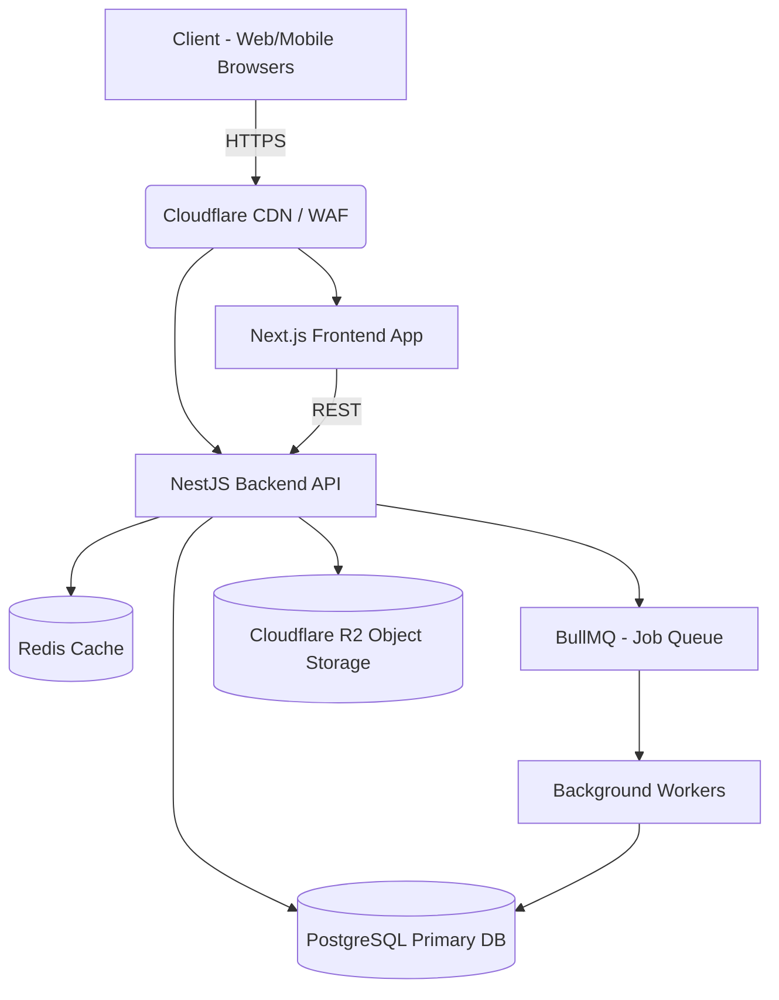

# CrossMart
### Myanmar's Most Trusted Cross-Border Marketplace

---

## 1. The Problem 💥

The e-commerce market in Myanmar is currently **fragmented** and lacks trust. 
- **Scattered Channels:** Buyers rely on Facebook Pages, Viber groups, and Messenger.
- **Lack of Transparency:** Pre-orders and cross-border cargo services offer little to no tracking visibility.
- **Trust Issues:** Difficult to verify authentic sellers or ensure secure transactions.

---

## 2. The Solution 💡

**CrossMart** unifies these fragmented ecosystems into a single, secure platform.
- **Verified Seller Ecosystem:** Strict onboarding processes ensure trust.
- **Transparent Tracking:** End-to-end visibility for cross-border cargo (e.g., Bangkok to Yangon).
- **Consolidated Commerce:** Brings Local, In-Stock, and Cross-Border items under one roof.
- **Competitive Pricing:** Direct connections between verified sellers and clients.

---

## 3. Key Roles & Target Users 👥

1. **Client (Buyer):** Individuals looking for authentic, competitively priced products with reliable cargo tracking.
2. **Sales Person (Seller):** Verified vendors with access to stock, cross-border cargo channels, or promotion opportunities.
3. **Admin (Moderator):** Oversees platform health, verifies sellers, resolves disputes, and manages master data.

---

## 4. Unique Core Features 🚀

- **Advanced Cargo Tracking:** Detailed milestone updates for cross-border shipments (e.g., Export Clearance, Air Cargo, YGN Warehouse).
- **Promotion Pre-buys:** Time-sensitive deals where sellers physically spot promotions abroad and list them for immediate pre-order.
- **Automated Workflows:** Intelligent approval rules for product listings based on seller trust scores.
- **Multi-Vendor Orders:** Seamlessly split carts into separate orders by seller, automatically calculating distinct shipping fees.

---

## 5. Technology Stack 🛠

A modern, highly-scalable stack tailored for rapid development and high performance.

- **Frontend:** Next.js 15 (App Router), React, TypeScript, TailwindCSS, shadcn/ui
- **Backend:** NestJS, TypeScript, Prisma ORM
- **Database:** PostgreSQL
- **Caching & Queues:** Redis, BullMQ (for async tasks like notifications)
- **Storage:** Cloudflare R2 (Object Storage)

---

## 6. System Architecture 🏗

---

## 7. Roadmap & Future Phases 🛣️

- **Phase 1 (Current):** Web Application, Core E-commerce Engine, Cargo Tracking, Seller Verification.
- **Phase 2 (Upcoming):** Android / iOS Mobile Apps, AI-based Recommendations, Advanced Search filtering.
- **Phase 3 (Expansion):** Multi-currency support, International Sellers onboarding, Public APIs for external integrations.
- **Phase 4 (Scale):** Transition object storage to AWS S3, Advanced Big Data Analytics for Sellers.

---

# Thank You!
**CrossMart** - Unifying Commerce Across Borders
