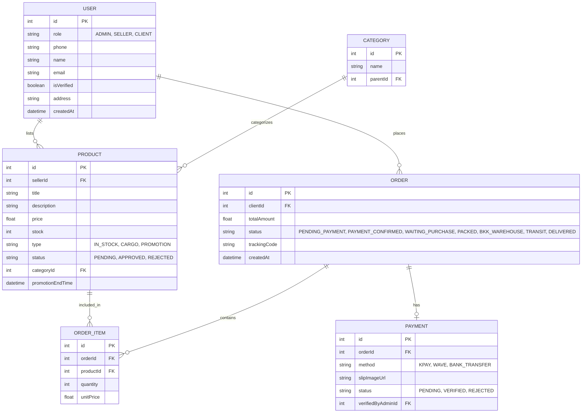

# Database Design (ERD)

This document outlines the core Entity-Relationship Diagram for the CrossMart database, managed via Prisma and PostgreSQL.

## Entity-Relationship Diagram

## Key Considerations
1. **User Role Separation:** A single `USER` table uses a `role` enum. Sellers are users with `role = SELLER`.
2. **Product Types:** The `PRODUCT` table utilizes a `type` enum to differentiate between standard stock and time-sensitive cargo/promotions.
3. **Order Status Tracking:** The `ORDER` table's `status` enum maps directly to the Cargo Tracking state machine.
