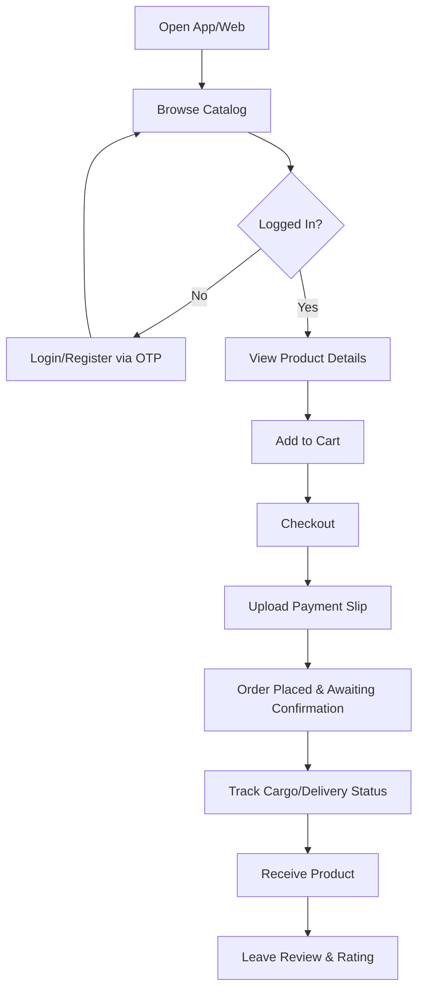
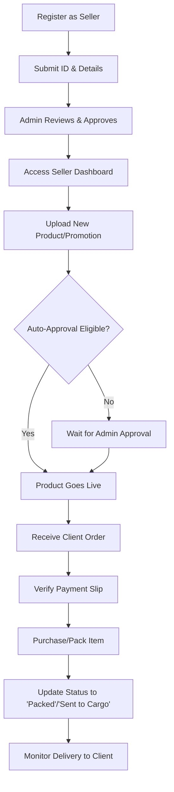
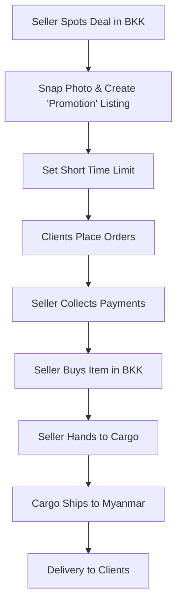
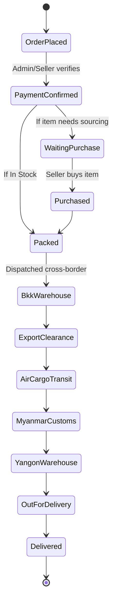

# User Flow and Business Workflow

## 1. Client (Buyer) User Flow

## 2. Sales Person (Seller) Workflow

## 3. Promotion / Pre-buy Special Workflow

## 4. Cargo Tracking Flow
This is the detailed state machine for an order involving cross-border cargo.

