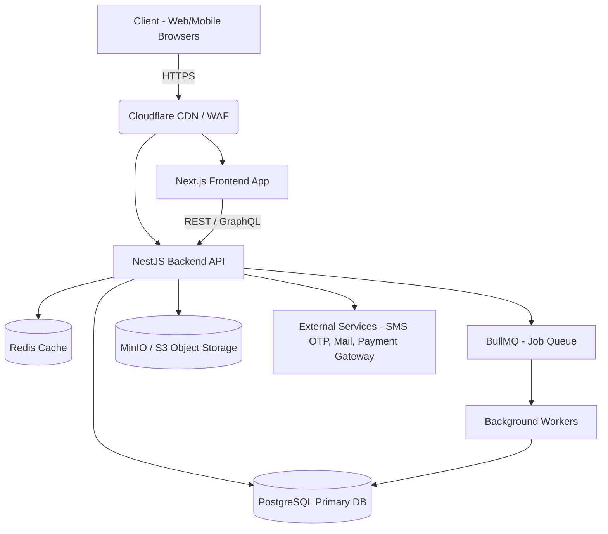

# System Architecture

## 1. High-Level Architecture Overview
CrossMart uses a modern, scalable, and modular Monorepo (or decoupled) architecture optimized for quick MVPs and robust scaling.

## 2. Technology Stack Details

### 2.1 Frontend
- **Framework:** Next.js 15 (App Router).
- **Language:** TypeScript.
- **Styling:** TailwindCSS with `shadcn/ui` for rapid, premium component building.
- **State Management:** Zustand + React Query (for server state).

### 2.2 Backend
- **Framework:** NestJS.
- **Language:** TypeScript.
- **ORM:** Prisma.
- **Authentication:** Auth.js (NextAuth) or NestJS Passport with JWT.

### 2.3 Data Layer
- **Relational Database:** PostgreSQL (Stores Users, Orders, Products).
- **Cache:** Redis (Caches category trees, hot promotion items).
- **Queue:** BullMQ (Handles asynchronous tasks like email sending, order status updates, and auto-approval cron jobs).
- **Storage:** MinIO or AWS S3 (Stores product images, payment slips, and user avatars).

### 2.4 Infrastructure & Deployment
- **Containerization:** Docker & Docker Compose.
- **Hosting / PaaS:** Coolify (Self-hosted Heroku alternative) or standard VPS (AWS EC2 / DigitalOcean).
- **Networking:** Cloudflare for DNS, CDN, and basic DDoS protection.
